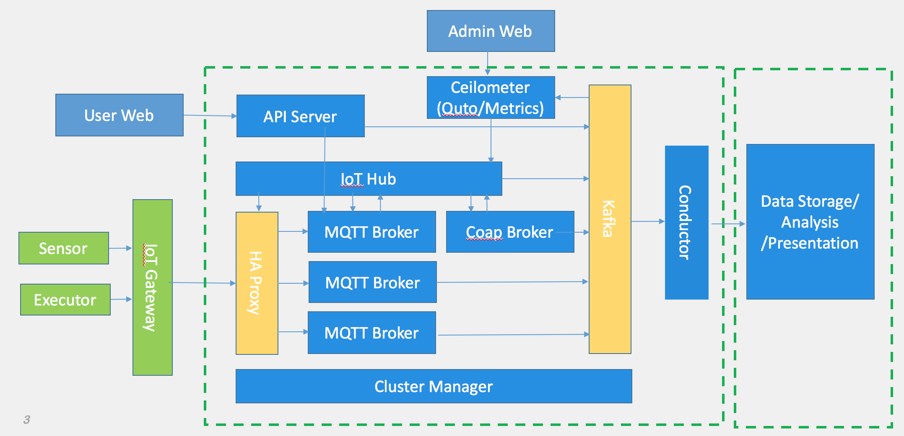

Overview
=====================================================
Sentel is iot cloud platform which can be deployed in private enterprise environment to provide the following functions.

* Allow devices to connect with iot cloud platform by MQTT/Coap
* Easyly manage products and devices using web services
* Many methods to analyze big data received from devices
* High performance and availiabity

Sentel is servie cluster based on micro service architecutre which include the following components.

 * API server is used for web, to provide iot manage role.
*  Iothub server provide device connection and message service(MQTT/Coap)
*  Keystone is authentication service
* Other service
 
Other service is not be designed till now. because the short time gola is device connection and message or data transimation, Simply, the following user case can be implemented in short time.

* User can use web service to add products and devices
* Authenticated devices can connect with sentel and publish and subscribe topic
* Device data can be stored in database

Features
==========================
* Private IoT platform withultiple deployment mode (standalone, cluster, cloud)
* Multiple tenant management
* Multiple access protocols (MQTT with websocket/TLS/TCP)
* Security/High Available/High Concurrent.
* Shadow Devices
* OTA
* High Configurability.
* High Diagnosable.

Architecture
==========================

Technology items
==========================

* Postgres is used to store user/product/device informations.
* Etcd is used to manage subscription tree
* Kafka is used to interchange message between services
* Golang is backend language
* Golang/echo is microservice web framework to develop REST web services
* Golang/gb is used as software build tool

 
